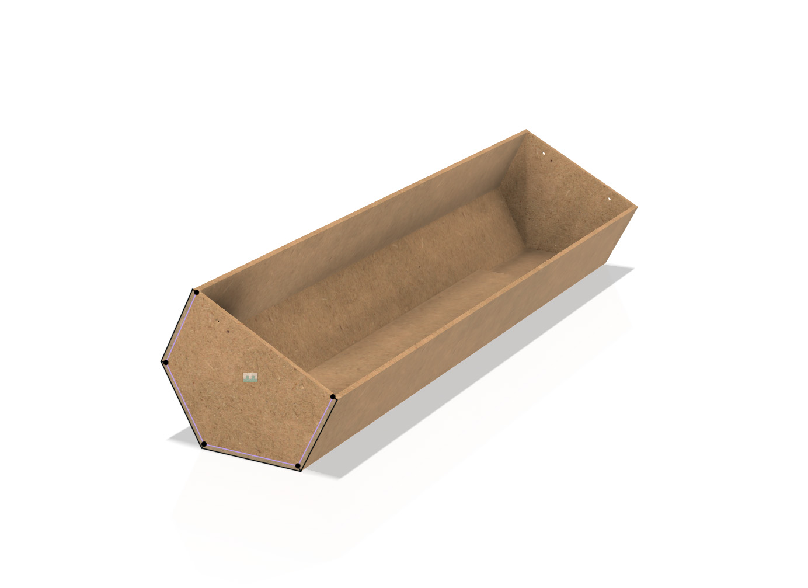
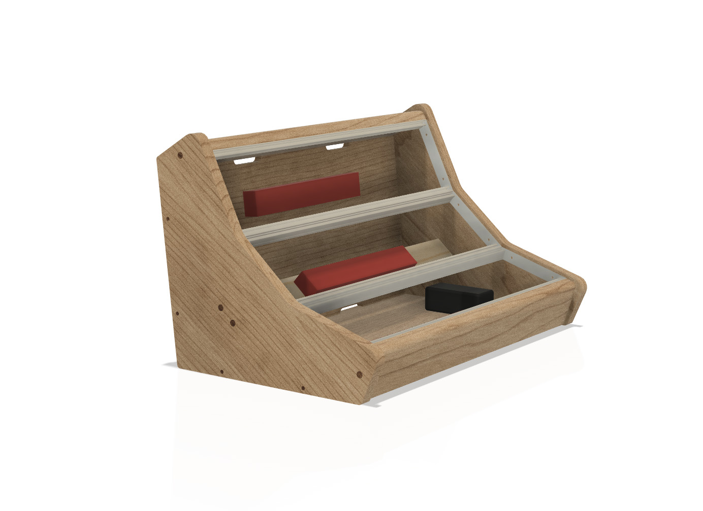

# skinpop diy eurorack cases
This repository holds Fusion360 design files for my eurorack cases.

Side panel screw holes for the rails are specific to the rails with end brackets sold by [Clicks & Clocks](https://clicksclocks.de/). 
Make sure to modify the files to fit your rails(including removing/modifying bracket thickness!) before starting a build!

The 9u case was designed to house a [Trogotronic m15](https://www.trogotronic.com/product/m15/) power solution. If you intend to build this case make sure you understand the requirements of your power solution of choice and update the design accordingly. 

The 9u design is parameterized and can be modifed by changing variables in the Parameters dialogue.

*3u MDF case*

*9u case*

